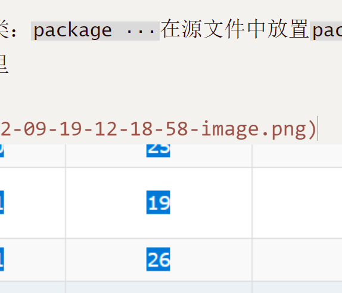

[TOC]

## Getting Started

Welcome to the VS Code Java world. Here is a guideline to help you get started to write Java code in Visual Studio Code.

## Folder Structure

The workspace contains two folders by default, where:

- `src`: the folder to maintain sources
- `lib`: the folder to maintain dependencies

Meanwhile, the compiled output files will be generated in the `bin` folder by default.

> If you want to customize the folder structure, open `.vscode/settings.json` and update the related settings there.

## Dependency Management

The `JAVA PROJECTS` view allows you to manage your dependencies. More details can be found [here](https://github.com/microsoft/vscode-java-dependency#manage-dependencies).

-----

## Java 核心技术

### Java 基础概念

- 简单性：没有头文件、指针运算、操作符重载等，基本解释器以及类库支持大约仅需要40KB，有基础的类库支持和多线程
- 面向对象：Java与C++的不同主要在于多重继承，在Java中，取而代之的是接口概念
- 分布式 
- 健壮性：Java与C++的最大不同在于Java采用的指针模型可以消除重写内存和损坏数据的可能性
- 体系结构中立：精心设计的字节码不仅可以在任何机器上解释执行，而且可以动态地转化成本地机器代码

- 解释型：Java解释器可以在任何移植解释器的机器上直接执行Java字节码

- 多线程：Java的多线程可以带来更快的交互响应和实时行为

### Java程序设计环境

#### 安装Java开发工具包

- JDK：编写Java程序的程序员使用的软件(**Java Development Kit**)

- JRE：运行Java程序的用户使用的软件(**运行平台，缩写 Java Runtime Environment**)解释器？

- SE：用于桌面或简单服务器应用的Java平台

- EE：用于复杂服务应用的Java平台

- ME：用于小型设备的Java平台(Micro Edition)

- Linux和Windows安装要**添加环境变量**，但是目前安装程序已经可以自动添加

#### 使用命令行工具

- **javac**程序是Java的编译器，它将filename.java编译成filename.class

#### 使用集成开发环境

- Eclipse、IDEA、NetBeans

- JShell (**Java 9后引入**)

### Java的基本程序设计结构

#### 一个简单Java应用程序

- public：访问修饰符

- class：Java程序中的全部内容都包含在类中

- 源代码的文件名必须与公共类的名字相同，并用`.java`作为扩展名

- 运行已编译程序时，Java虚拟机总是从指定类中的`mian`方法的代码开始执行（在类中定义的函数被成为方法）

- Java中每个句子必须用分号结束

- `System.out`是一个对象，`System.out.println()`是它的方法。Java的通用语法是`object.method(parameters)`。`System.out`还有`print`方法，但是它不在输出之后增加换行符

#### 数据类型

- Java是一种强类型语言
  
  - 4种整型
    
    - int-4字节
    
    - short-2字节
    
    - long-8字节
    
    - byte-1字节
  
  - 2种浮点型
    
    - float-4字节
    
    - double-8字节
  
  - 1种char类型
    
    - **我们强烈建议不要在程序中使用char类型，除非真的需要处理UTF-16代码单元。最好将字符串作为抽象数据类型处理**
  
  - 1种boolean类型

#### 变量和常量

- 逐一声明每一个变量可以提高程序的可读性

- `final`指示常量。关键字`final`表示这个变量只能被赋值一次。一旦被赋值之后，就不能够再更改了。习惯上，**常量名使用全大写**

- 在Java中，如果希望一个常量可以在一个类的多个方法中使用，通常将这些常量称为类常量。可以使用关键字`static final`设置一个类常量。

- 枚举类型，如`enum Size = {SMALL,MEDIUM,LARGE,EXTRA_LARGE}`。调用`Size s = Size.MEDIUM`

#### 运算符

- Java没有幂运算，需要借助 `Math`类的`pow`方法

- `&&`逻辑与、`||`逻辑或、三元操作符`condition ? expression1 : expression2`，如`x<y?x:y`取最小值

- Java没有内置的字符串类型，在标准Java类库中提供一个预定义的类，叫做`String`
  
  - 字串-`str.substring(0,3)`
  
  - 拼接-`+`
  
  - 重新赋值就是修改字符串，Java中如果一个内存块不再使用了，系统最终会将其回收
  
  - 相等-`s.equals(t)`。一定不要用`==`运算符检测两个字符串是否相等，它们只是确定两个字符串是否存放在同一个位置上
  
  - 空串检测
  
  
  
  - `StringAPI`包含字符串的常用方法
  
  - 构建字符串-使用一个builder容器，向其中添加，然后整体输出为字符串
  
  

#### IO操作

- 读取输入：
  
  - `Scanner in = new Scanner(System.in)`
  
  - `System.out.print("What is your name");  String name = in.nextLine();`
  
  - 添加代码`import java.util.*;`，因为`Scanner`类定义在`java.util`包中

- 格式化输出字符串`System.out.printf`

- 文件读写
  
  - `new Scanner(Path.of("myfile.txt"),StandardCharsets.UTF_8)`

#### 控制流程

- 块作用域
  
  - 一个块可以嵌套在另一个块
  
  - 不能在嵌套的两个块中声明同名的变量

- 条件语句`if(condition1){} else if{condition2} else{}`

- 循环语句`while`和`do while`，后者do中的语句会至少执行一次

- `for`语句和C++是一样的

- `switch`语句

- `break`和`continue`语句

#### 大数（好像暂时没有需求）

#### 数组

- 声明数组 `int[] a = new int[100];  int smallPrimes = {2,3,5,7,11,13}`

- 数组一旦创建，长度就无能改变

- 如果需要扩展数组的大小，还有一种数据结构`array list`

- `for each`循环，下面说到了接口问题，可能类似Python中的类设计时为顶层函数预留的接口`__str__`或`__iter__`

- 数组拷贝

- 命令行参数：每一个Java应用程序都有一个带`String arg[]`参数的`main`方法。这个参数表明`main`方法将接收一个字符串数组，也就是命令行上指定的参数

- 数组排序(用的是QuickSort)

对象和类

- OOP是当今主流的程序设计泛型，取代了20实际70年代的“结构化”或过程式编程技术

- 程序中的很多对象来自标准库，还有自定义。我们可以自己构造对象或者从外界“购买”对象

- 传统的结构化程序设计（Pascal 算法＋数据结构 = 程序）而OOP调换了次序，认为数据（结构）优先，其次考虑操作数据的算法

- 对于一些规模较小的问题，将其分解为过程的开发方式比较理想。面向对象更加适合解决规模较大的问题。要想实现一个简单的Web浏览器可能需要大约2000个过程，这些过程可能需要对一组全局数据进行操作。采用面向对象的设计风格，可能只要100个类，每个类平均包含20个方法，这样更利于程序员找到bug和掌握程序结构。

- 类-小甜饼的模具、对象-小甜饼

- 由类构造（construct）对象的过程成为创建类的实例（instance）

- 封装（数据隐藏）是处理对象的一个重要概念。对象中的数据成为实例字段（instance field），操作数据的过程称为方法（method）

- 在Java中，所有的类都源自一个“神通广大”的超类——Object，所有其他类都扩展自这个类

- 通过扩展一个类来建立另外一个类的过程成为继承(inheritance)

- 类之间的关系
  
  - 依赖(use-a)：如果一个类的方法使用或操纵另一个类的对象，就说一个类依赖另一个类。软件工程中，应该减少类之间的耦合
  
  - 聚合(has-a)
  
  - 继承(is-a)

- 在Java中，使用构造器(构造函数)构造新实例。例子，要想构造一个`Date`对象，需要在构造函数前面加上`new`操作符

- 对象与对象变量之间存在一个重要的区别。即在使用一个对象变量的具体方法前，我们一定要对这个对象变量进行实例化

- 用户自定义类的编写，和Python没有太大差别

- 多个源文件的使用（和Python也是类似的）
  
  - 许多程序员习惯将每一个类存放在一个单独的源文件中，然后直接编译main程序所在的java文件。编译器会自动检查调用文件的更新并且编译。

- 可以用`public`标记实例字段，但是这是一种很不好的做法，`public`数据字段允许程序中的任何方法对其进行读取和修改，这会破坏封装

- **构造器与其他方法的一个重要不同就在于，构造函数总是结合`new`运算符来调用**。而且不能对一个已经存在的对象调用构造函数来达到重新设置实例字段的目的。而是应该使用接口操作。

- Java中提供了`this`这样的关键字用于指示隐式参数，即实例字段

- 类设计中的`get*`方法也叫字段访问器

- 对于可变的类，使用`final`标记会造成混乱。
  
  - 如`private final StringBuilder evaluations;`

- 类的方法可以访问所属类任何对象的私有特性(feature)，而不仅限于隐式参数

- 静态字段：如果一个字段定义为`private static`，每个类只有一个这样的字段。这样的字段属于类，而不属于任何单个的对象

- 静态常量(常用)：例如，在`Math`类中定义一个静态常量：
  
  
  
  在程序中，可以用`Math.PI`来访问这个常量。

- 静态方法(常用)：静态方法是不在对象上执行的方法

- 例如，`Math`类的`pow`方法就是一个静态方法。`Math.pow(x,a)`

- 工厂方法-格式化字符串

- `main`方法：`main`方法不对任何对象进行操作。事实上，在启动程序时还没有任何对象。每一个类可以有一个`main`方法，这常用于对类进行单元测试。

- Java程序设计语言采用按值调用。传参传对象，调用对象的方法实现**值的修改**

- 构造函数
  
  - 重载：查找匹配的过程被称为**重载解析**
  
  - Java会自动完成gc，因此不需要人工回收内存

- 在包中增加类：`package ···`在源文件中放置`package`语句，这个源文件被放入包里

